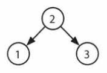

# Decifrando la Entrevista Tecnica `Ejercicio 4.9 Secuencias de Árboles de Búsqueda Binaria`

## `Descripción:`

Se creó un árbol de búsqueda binaria al recorrer un arreglo de izquierda a derecha e insertar cada elemento. Dado un árbol de búsqueda binaria con elementos distintos, imprime todas las posibles secuencias que podrían haber llevado a este árbol.

EJEMPLO

Entrada:

Salida: {2, 1, 3}, {2, 3, 1}

---

## `Solución:`