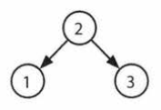

# Cracking The Coding Interview Exercise 4.9 BST Sequences

A binary search tree was created by traversing through an array from left to right
and inserting each element. Given a binary search tree with distinct elements, print all possible
arrays that could have led to this tree.
EXAMPLE
Input:

Output: {2, 1, 3}, {2, 3, 1}

## Description

# Solution
